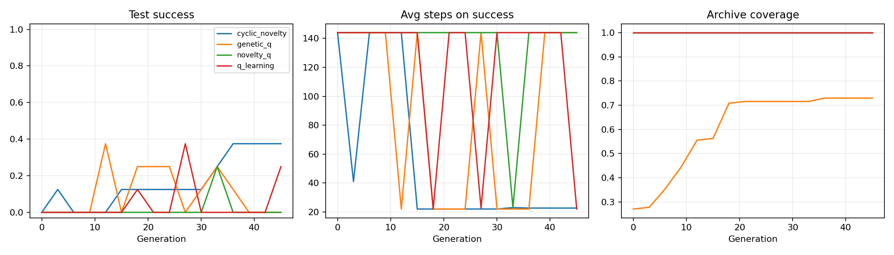
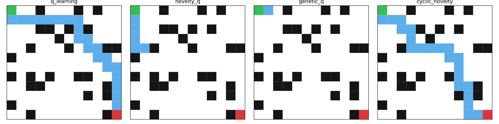

# Maze Novelty

## Archive Notice

This project was archived on 2026-04-20.

It remains a historical record for cyclic novelty, motif replay, behavior-prior
transfer, and transfer-ladder diagnostics. It is no longer the active research
line. The next project should start from artificial-life population ontology:

```text
World -> Habitat -> Population -> Organism -> Lifetime -> Experience -> Inheritance -> Lineage
```

Closure note:

- `docs/project_closure_2026-04-20.md`
- `docs/archive/README.md`

Maze Novelty is an experimental research repo for cyclic novelty, replay, motif
memory, and transfer in small GridWorld and MiniGrid tasks.

The project started as a maze-solving playground, but its current purpose is
more specific:

```text
find evolutionary training cycles that create useful pretraining artifacts
for future adaptation
```

The long-term target is not "win this one maze." The long-term target is a
learning system that can:

- pretrain on one environment family;
- export inherited structure;
- adapt faster on a new environment;
- keep evolving without collapsing into task-specific tricks.

## Current Focus

The active research frame is:

```text
pretrain artifact
-> target probe
-> target-side reuse / behavior prior
-> adaptation metrics
```

The current branch adds a first executable behavior-prior scaffold:

- structural `StateSignature` matching;
- short `BehaviorPrior` objects derived from navigation motifs;
- early adaptation prior execution in addition to trace reinforcement;
- execution diagnostics for matched priors, executed priors, and executed
  episode structure.

The latest writeup for that step is:

- `docs/v1.4.7_behavior_prior_transfer.md`

## Visual Snapshot

Early GridWorld experiment snapshot:



Representative path behavior across baseline methods:



## Main Method Families

The repo has accumulated several related method families. The most important
recent ones are:

| Method | Role |
| --- | --- |
| `cyclic_operate_replay` | clean pretraining baseline with simple replay |
| `cyclic_motif_fast_replay` | success-fragment branch with speed discipline |
| `cyclic_subgoal_ecology_replay` | failure-memory branch for sparse tasks |
| `+target_reuse` transfer path | target-side trace/prior reuse during adaptation |

These should be compared by transfer usefulness, not only by source-task score.

## Repository Layout

```text
src/
  core/           shared experiment utilities and behavior-prior types
  pretraining/    artifact builders and source-side schedules
  transfer/       target-side evaluation and adaptation metrics
  minigrid_*      MiniGrid adapter, encoders, training, diagnostics
  train.py        older GridWorld training entrypoint

scripts/
  benchmark, diagnostic, and summarization entrypoints

configs/
  small GridWorld presets

docs/
  versioned writeups, plans, experiment notes, and handoff docs
```

## Quick Start

## Environment

This workspace currently uses:

```text
maze_novelty/.venv -> ../.shared-envs/maze_novelty
```

and a shared `uv` download/build cache:

```text
maze_novelty/uv.toml -> cache-dir = "../.uv-cache"
```

Implications:

- `uv run ...` and `uv sync` inside this repo use the Maze-specific environment
  under `/.shared-envs/maze_novelty`
- the workspace-root `/.venv` is legacy backup only and should not be used as
  the source of truth for this repo
- from the workspace root, `./bin/park-env sync maze` is the safe way to
  refresh this environment

If you are working only inside this repo, the usual `uv` commands remain valid.

Install dependencies:

```bash
uv sync
```

Sanity-check the environment:

```bash
uv run python src/train.py --config configs/quick.toml --dry-run
uv run python scripts/check_env.py
```

## Common Commands

GridWorld smoke run:

```bash
uv run python src/train.py --config configs/quick.toml --no-plots
```

MiniGrid benchmark smoke:

```bash
uv run python scripts/run_minigrid_benchmark.py \
  --env-id MiniGrid-FourRooms-v0 \
  --name fourrooms_pilot
```

Transfer diagnostic:

```bash
uv run python scripts/run_pretraining_transfer_diagnostic.py \
  --seeds 7,17,27 \
  --pretrain-episodes 40 \
  --adapt-episodes 30 \
  --eval-every 10 \
  --eval-episodes 4 \
  --output outputs/pretraining_transfer_diagnostic_v1.csv \
  --summary-output outputs/pretraining_transfer_diagnostic_v1_summary.csv
```

Behavior-prior quick probe:

```bash
uv run python scripts/run_pretraining_transfer_diagnostic.py \
  --seeds 7 \
  --target-envs MiniGrid-MultiRoom-N2-S4-v0,MiniGrid-MultiRoom-N4-S5-v0 \
  --pretrain-episodes 20 \
  --adapt-episodes 20 \
  --eval-every 10 \
  --eval-episodes 3 \
  --include-target-reuse \
  --output outputs/pretraining_behavior_prior_probe.csv \
  --summary-output outputs/pretraining_behavior_prior_probe_summary.csv
```

## Quality Checks

Run these before treating a local state as a version candidate:

```bash
uv run ruff check src scripts tests
uv run pyright src scripts
uv run pytest
uv run python scripts/check_env.py
```

## Key Documents

Start here if you want the project story in order:

- `docs/version_history.md`
  Historical record of the major tags and lessons.
- `docs/pretraining_transfer_framework.md`
  The current central research framing.
- `docs/v1.4.7_behavior_prior_transfer.md`
  The current behavior-prior transfer scaffold and probe result.
- `docs/task_suite_plan.md`
  Why FourRooms stopped being enough and how the task ladder evolved.
- `docs/theory_structural_novelty_and_options.md`
  Theory note connecting novelty, reusable transitions, and options.
- `docs/handoff_2026-04-19_behavior_prior_transfer.md`
  Maintainer handoff for the current public branch state.
- `docs/versioning.md`
  The repo's versioning and publishing discipline.
- `docs/archive/README.md`
  Archive navigation guide for reopening the repo later.

## Outputs

Generated artifacts stay local under `outputs/`. The repo intentionally does
not track benchmark CSVs or plots, except for `outputs/README.md`.

Typical outputs include:

- `metrics.csv`
- `summary.csv`
- `summary.png`
- `paths.png`

Stable conclusions should be promoted into `docs/`, not committed from
`outputs/`.

## Versioning Discipline

This repo uses small, explicit research checkpoints instead of long-lived
unstructured drift.

The usual sequence is:

```text
single mechanism change
-> checks
-> focused run
-> written interpretation
-> commit or tag
```

The public GitHub repo includes all historical tags up to:

```text
v1.4.6-version-history-and-tests
```

The current post-tag work lives on:

```text
experiment/behavior-prior-transfer
```

## Current Status

What is true right now:

- the public repo is live at `wang-yzh/maze-novelty`;
- the current branch has an executable behavior-prior scaffold;
- target-side priors can be extracted, merged, matched, and executed;
- transfer success is still unresolved;
- the next clean question is whether executed-prior episodes improve structure
  consistently across more seeds.

What should not be claimed yet:

- that behavior priors already solve MultiRoom;
- that a final winning pretraining cycle has been found;
- that item count alone is evidence of transfer quality.

## Short Thesis

The repo is best understood this way:

```text
Novelty creates variation.
Selection keeps useful variation.
Memory stores useful traces.
Behavior priors try to make traces inheritable.
Transfer tests whether inherited structure improves future adaptation.
```
